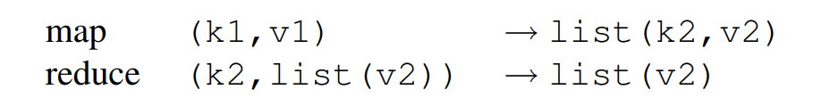
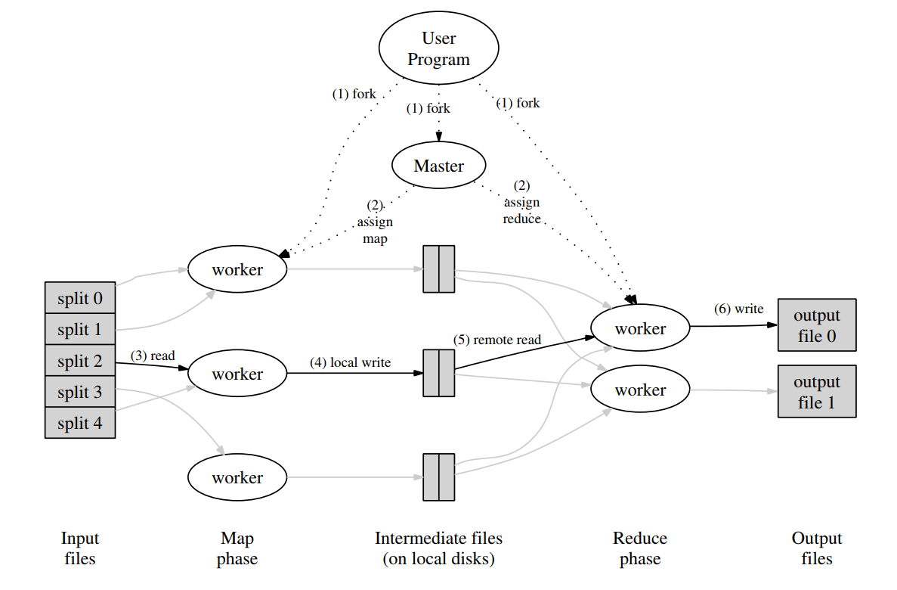

# 6.824 分布式系统学习

用于记录6.824分布式系统学习的内容。

## 参考资料

* [参考mapreduce项目](https://github.com/yzongyue/6.824-golabs-2020)

# mapReduce思想

MapReduce的原理：





```
由上述两幅图可以涵盖MapReduce的思想。分布式系统中有很多计算机，其中有一个是master，其他是worker，然后master负责将任务划分为M个task，然后只要有worker空闲了，就去拿task执行map，就会产生R个结果存在disk中(M通常与输入有关，例如M个文件，R为自定义的reduce任务数)。后面执行reduce的worker，就会根据他的编号（0到R-1），通过RPC来从其他worker拿到对应的map结果。然后reducer肯定就会得到若干(k2, list(v2))的key-value pair，再把这个传给reduce-function（用户定义的），得到的结果存起来就完事了。后面就是把reduce的结果merge起来。

经典例子是word-counter，我们输入的是若干篇文章，也就是list(k1, v1)，其中k1就是文章的filename，v就是content。然后，master会将所有的文章分成M份，分别派发给这么多的worker去做（不一定是同一时刻）。那么worker执行map的时候，就会把每个(k1, v1)都去执行map-function（用户定义的），然后得到的结果是(k2, v2)，这里的k2就是word，v2就是word出现的次数。然后，将所有的(k2, v2)对分成R份，存在磁盘中。那么，等所有的map都做完后，其实是有M*R个文件的。后面reduce过程就会将其reduce id对应的所有map result收集起来，因为一个word会在不同的map result中出现，所以我们整理会得到一个(k2, list(v2))，再对每一个这样的pair调用reduce-function，就会得到(k2, v2)，也就是把同一个单词出现的次数都加起来了。然后存在结果中就好了，等待merge。
```

# 程序思路解析

test-mr.sh的思路是将正常顺序执行过程mrsequential和mrmaster、mrworker的rpc调用方式的结果比对，一致则PASS。 

## master

```
1.Master结构体初始化(锁mu、nReduce、输入文件files，任务通道taskCh)
2.初始化MapTask任务，置任务状态为TaskStatusReady
3.go m.tickSchedule()中运行调度函数go m.schedule()，控制worker和task。同时tickSchedule会判断master处理状态，非完成任务态会循环调用go m.schedule()来触发任务循环
4.go http.Serve(l, nil)，启动线程监听worker的rpc调用
5.在schedule()中，首先执行所有MapTask，执行完毕后，执行ReduceTask
6.主程序中m.Done()判断Master是否处理完成，完成后退出。
```

## worker

```
1.worker通过loadPlugin方法加载事先已经生成的../mrapps/wc.so，即mapf, reducef的具体定义
2.Worker结构体初始化(mapf,reducef),然后register函数中调用Master.RegWorker方法，注册并获得WorkerId
3.run() 函数中调用Master.GetOneTask获取需要执行的任务
4.doTask中判断Phase，从而执行doMapTask或doReduceTask，一般是等所有doMapTask执行好，才会到doReduceTask。
5.doMapTask执行完毕，调用Master.ReportTask，触发Master对应seq任务的taskStats变更。
6.即按照上述流程完成MapTask和ReduceTask的处理，并通过Master.ReportTask上报
7.worker要不到任务后，也会执行完成退出。
```

## 交互过程

```
1.Master结构体初始化
2.initMapTask完成taskPhase，taskStats的创建(MapPhase,taskStats数组)
3.schedule中m.taskStats初始值为TaskStatusReady,调用getTask创建任务，并传递给通道m.taskCh
4.worker通过rpc调用GetOneTask,触发task将任务状态转变成TaskStatusRunning，且通过rpc将任务分发给worker
5.worker通过ReportTask，将任务完成情况上报给master,所有任务的mapTask都是TaskStatusFinish，则进入initReduceTask
6.initReduceTask完成taskPhase，taskStats的创建(ReducePhase,taskStats数组)
7.ReduceTask的处理过程类似MapTask
```


