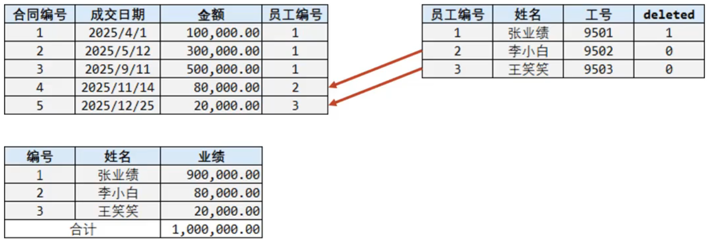
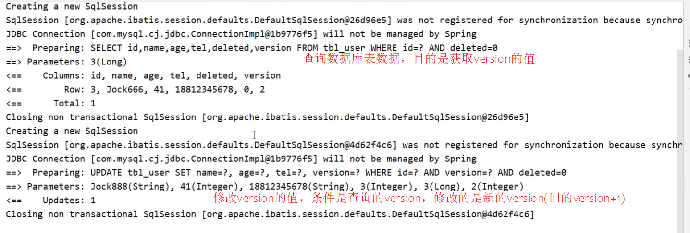
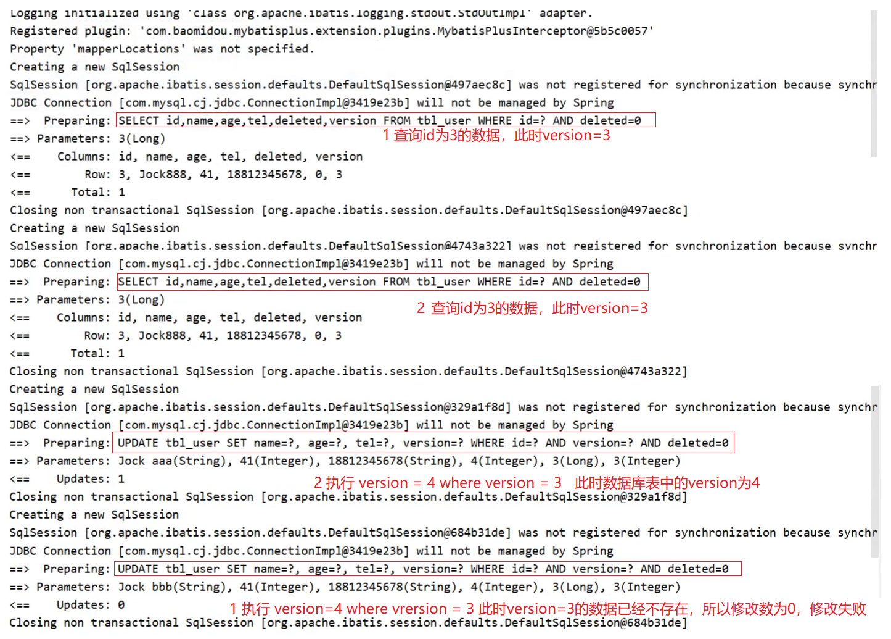

# MyBatisPlus

# MybatisPlus简介

MyBatisPlus（简称MP）是基于MyBatis框架基础上开发的增强型工具，旨在**简化开发、提高效率**

官网:`https://mp.baomidou.com/`

MP的特性:

* 无侵入：只做增强不做改变，引入它不会对现有工程产生影响，如丝般顺滑
* 损耗小：启动即会自动注入基本 CURD，性能基本无损耗，直接面向对象操作
* 强大的 CRUD 操作：**内置通用 Mapper、通用 Service**，仅仅通过少量配置即可实现单表大部分 CRUD 操作，更有强大的条件构造器，满足各类使用需求
* 支持 Lambda 形式调用：**通过 Lambda 表达式，方便的编写各类查询条件**，无需再担心字段写错
* 支持主键自动生成：支持多达 4 种主键策略（内含分布式唯一 ID 生成器 - Sequence），可自由配置，完美解决主键问题
* 支持 ActiveRecord 模式：支持 ActiveRecord 形式调用，实体类只需继承 Model 类即可进行强大的 CRUD 操作
* 支持自定义全局通用操作：支持全局通用方法注入（ Write once, use anywhere ）
* 内置代码生成器：采用代码或者 Maven 插件可快速生成 Mapper 、 Model 、 Service 、 Controller 层代码，支持模板引擎，更有超多自定义配置等您来使用
* 内置分页插件：基于 MyBatis 物理分页，开发者无需关心具体操作，配置好插件之后，写分页等同于普通 List 查询
* 分页插件支持多种数据库：支持 MySQL、MariaDB、Oracle、DB2、H2、HSQL、SQLite、Postgre、SQLServer 等多种数据库
* 内置性能分析插件：可输出 SQL 语句以及其执行时间，建议开发测试时启用该功能，能快速揪出慢查询
* 内置全局拦截插件：提供全表 delete 、 update 操作智能分析阻断，也可自定义拦截规则，预防误操作

## 支持数据库

MySQL，Oracle，DB2，H2，HSQL，SQLite，PostgreSQL，SQLServer，Phoenix，Gauss ，ClickHouse，Sybase，OceanBase，Firebird，Cubrid，Goldilocks，csiidb

## 框架结构


# 标准数据层开发

## 标准CRUD使用

MyBatisPlus 提供两种类型的CRUD接口：`Service CRUD 接口` 和 `Mapper CRUD 接口`

* 通用 Service CRUD 封装IService (opens new window)接口，进一步封装 CRUD 采用 get 查询单行 remove 删除 list 查询集合 page 分页 前缀命名方式区分 Mapper 层避免混淆，
* 通用 Mapper CRUD 封装BaseMapper (opens new window)接口，为 Mybatis-Plus 启动时自动解析实体表关系映射转换为 Mybatis 内部对象注入容器

两者对比：

* Service简直是BaseMapper的大扩充，不但包含了所有基本方法，还加入了很多批处理功能

MP提供的标准的Mapper CRUD功能:


Dao接口 

```
@Mapper
public interface UserDao extends BaseMapper<User>{
}
```

Service接口

```
resources/mapper/StudentMapper.xml  映射关系表
com.klc.mapper.StudentMapper        StudentMapper接口
@Mapper
public interface StudentMapper extends BaseMapper<Student> {


com.klc.service.StudentService      业务接口类

public interface StudentService extends IService<Student> {

}

com.klc.service.impl.StudentServiceImpl   业务实现类

@Service
public class StudentServiceImpl extends ServiceImpl<StudentMapper, Student>
    implements StudentService{

}
}
```

## Lombok

Lombok，一个Java类库，提供了一组注解，简化POJO实体类开发。

### 使用步骤

1. 步骤1:添加lombok依赖

2. 步骤2:安装Lombok的插件

3. 步骤3:模型类上添加注解

Lombok常见的注解有:

* @Setter:为模型类的属性提供setter方法
* @Getter:为模型类的属性提供getter方法
* @ToString:为模型类的属性提供toString方法
* @EqualsAndHashCode:为模型类的属性提供equals和hashcode方法
* **@Data:是个组合注解，包含上面的注解的功能**
* **@NoArgsConstructor:提供一个无参构造函数**
* **@AllArgsConstructor:提供一个包含所有参数的构造函数**

## 分页功能

分页查询使用的方法是:

```java
IPage<T> selectPage(IPage<T> page, Wrapper<T> queryWrapper)
```

- IPage:用来构建分页查询条件
- Wrapper：用来构建条件查询的条件，目前我们没有可直接传为Null
- IPage:返回值，你会发现构建分页条件和方法的返回值都是IPage

IPage是一个接口，我们需要找到它的实现类来构建它，具体的实现类，可以进入到IPage类中按ctrl+h,会找到其有一个实现类为`Page`。

1. 步骤1:调用方法传入参数获取返回值

```java
@SpringBootTest
class Mybatisplus01QuickstartApplicationTests {

    @Autowired
    private UserDao userDao;
    
    //分页查询
    @Test
    void testSelectPage(){
        //1 创建IPage分页对象,设置分页参数,1为当前页码，3为每页显示的记录数
        IPage<User> page=new Page<>(1,3);
        //2 执行分页查询
        userDao.selectPage(page,null);
        //3 获取分页结果
        System.out.println("当前页码值："+page.getCurrent());
        System.out.println("每页显示数："+page.getSize());
        System.out.println("一共多少页："+page.getPages());
        System.out.println("一共多少条数据："+page.getTotal());
        System.out.println("数据："+page.getRecords());
    }
}
```

2. 步骤2:设置分页拦截器

这个拦截器MP已经为我们提供好了，我们只需要将其配置成Spring管理的bean对象即可。

```java
@Configuration
public class MybatisPlusConfig {
    
    @Bean
    public MybatisPlusInterceptor mybatisPlusInterceptor(){
        //1 创建MybatisPlusInterceptor拦截器对象
        MybatisPlusInterceptor mpInterceptor=new MybatisPlusInterceptor();
        //2 添加分页拦截器
        mpInterceptor.addInnerInterceptor(new PaginationInnerInterceptor());
        return mpInterceptor;
    }
}
```


3. 步骤3:运行测试程序

如果想查看MP执行的SQL语句，可以修改application.yml配置文件，

```yml
mybatis-plus:
  configuration:
    log-impl: org.apache.ibatis.logging.stdout.StdOutImpl #打印SQL日志到控制台
```

取消初始化spring日志打印，**resources目录下添加logback.xml**，名称固定，内容如下:

```xml
<?xml version="1.0" encoding="UTF-8"?>
<configuration>
</configuration>
```

# DQL编程控制

增删改查四个操作中，查询是非常重要的也是非常复杂的操作，这块需要我们重点学习下，这节我们主要学习的内容有:

* 条件查询方式
* 查询投影
* 查询条件设定
* 字段映射与表名映射

## 条件查询

```java
@SpringBootTest
class Mybatisplus02DqlApplicationTests {

    @Autowired
    private UserDao userDao;
    
    //方法1： QueryWrapper 简单查询
    @Test
    void testGetAll(){
        QueryWrapper qw = new QueryWrapper();
        qw.lt("age",18);
        List<User> userList = userDao.selectList(qw);
        System.out.println(userList);
    }
	
	//方法2：QueryWrapper的基础上使用lambda
	@Test
    void testLamdaGetAll(){
        QueryWrapper<User> qw = new QueryWrapper<User>();
        qw.lambda().lt(User::getAge, 10);//添加条件
        List<User> userList = userDao.selectList(qw);
        System.out.println(userList);
    }
	
	//方法3：使用LambdaQueryWrapper
	@Test
    void testLambdaQueryGetAll(){
        LambdaQueryWrapper<User> lqw = new LambdaQueryWrapper<User>();
        lqw.lt(User::getAge, 10);
        List<User> userList = userDao.selectList(lqw);
        System.out.println(userList);
    }
	
	//方法4：多条件构造
	@Test
    void testMutiConditionGetAll(){
        LambdaQueryWrapper<User> lqw = new LambdaQueryWrapper<User>();
        lqw.lt(User::getAge, 30);
        lqw.gt(User::getAge, 10);
        List<User> userList = userDao.selectList(lqw);
        System.out.println(userList);
    }
	//方法5：null判定
	@Test
    void testNullJudgeGetAll(){
        //模拟页面传递过来的查询数据
        UserQuery uq = new UserQuery();
        uq.setAge(10);
        uq.setAge2(30);
        LambdaQueryWrapper<User> lqw = new LambdaQueryWrapper<User>();
        lqw.lt(null!=uq.getAge2(),User::getAge, uq.getAge2());
        lqw.gt(null!=uq.getAge(),User::getAge, uq.getAge());
        List<User> userList = userDao.selectList(lqw);
        System.out.println(userList);
    }
}
```

* 方法1：有个小问题就是在写条件的时候，容易出错，比如age写错，就会导致查询不成功

* 方法2：User::getAge,为lambda表达式中的，类名::方法名，最终的sql语句为:

```sql
SELECT id,name,password,age,tel FROM user WHERE (age < ?)
```
  * 编写条件的时候，就不会存在写错名称的情况，但是qw后面多了一层lambda()调用
  
* 方法3：这种方式就解决了上一种方式所存在的问题。

* 方法4：多条件构造
    * 构建多条件的时候，可以支持链式编程
    * or()就相当于我们sql语句中的`or`关键字,不加默认是`and`

* 方法5：null判定
    * condition为boolean类型，返回true，则添加条件，返回false则不添加条件

## 查询投影

### 查询指定字段

在查询数据时，什么都没有做默认就是查询表中所有字段的内容，所说的查询投影即不查询所有字段，只查询出指定内容的数据。

```java
@SpringBootTest
class Mybatisplus02DqlApplicationTests {

    @Autowired
    private UserDao userDao;
    
    @Test
    void testGetAll(){
        LambdaQueryWrapper<User> lqw = new LambdaQueryWrapper<User>();
        lqw.select(User::getId,User::getName,User::getAge);//lqw.select("id","name","age","tel");
        List<User> userList = userDao.selectList(lqw);
        System.out.println(userList);
    }
}
```

* select(...)方法用来设置查询的字段列，可以设置多个，最终的sql语句为:

  ```sql
  SELECT id,name,age FROM user
  ```

### 聚合查询

使用聚合函数查询，完成count、max、min、avg、sum的调用


```java
@SpringBootTest
class Mybatisplus02DqlApplicationTests {

    @Autowired
    private UserDao userDao;
    
    @Test
    void testGetAll(){
        QueryWrapper<User> lqw = new QueryWrapper<User>();
        //lqw.select("count(*) as count");
        //SELECT count(*) as count FROM user
        //lqw.select("max(age) as maxAge");
        //SELECT max(age) as maxAge FROM user
        //lqw.select("min(age) as minAge");
        //SELECT min(age) as minAge FROM user
        //lqw.select("sum(age) as sumAge");
        //SELECT sum(age) as sumAge FROM user
        lqw.select("avg(age) as avgAge");
        //SELECT avg(age) as avgAge FROM user
        List<Map<String, Object>> userList = userDao.selectMaps(lqw);
        System.out.println(userList);
    }
}
```

### 分组查询

需求:分组查询，完成 group by的查询使用

```java
@SpringBootTest
class Mybatisplus02DqlApplicationTests {

    @Autowired
    private UserDao userDao;
    
    @Test
    void testGetAll(){
        QueryWrapper<User> lqw = new QueryWrapper<User>();
        lqw.select("count(*) as count,tel");
        lqw.groupBy("tel");
        List<Map<String, Object>> list = userDao.selectMaps(lqw);
        System.out.println(list);
    }
}
```

* groupBy为分组，最终的sql语句为

  ```sql
  SELECT count(*) as count,tel FROM user GROUP BY tel
  ```

**注意:**

* 聚合与分组查询，无法使用lambda表达式来完成
* MP只是对MyBatis的增强，如果MP实现不了，我们可以直接在DAO接口中使用MyBatis的方式实现

## 查询条件

MP的查询条件有很多:

* 范围匹配（> 、 = 、between）
* 模糊匹配（like）
* 空判定（null）
* 包含性匹配（in）
* 分组（group）
* 排序（order）
* ……

### 等值查询

> 需求:根据用户名和密码查询用户信息

```java
@SpringBootTest
class Mybatisplus02DqlApplicationTests {

    @Autowired
    private UserDao userDao;
    
    @Test
    void testGetAll(){
        LambdaQueryWrapper<User> lqw = new LambdaQueryWrapper<User>();
        lqw.eq(User::getName, "Jerry").eq(User::getPassword, "jerry");
        User loginUser = userDao.selectOne(lqw);
        System.out.println(loginUser);
    }
}
```

* eq()： 相当于 `=`,对应的sql语句为

  ```sql
  SELECT id,name,password,age,tel FROM user WHERE (name = ? AND password = ?)
  ```

* selectList：查询结果为多个或者单个
* selectOne:查询结果为单个

### 范围查询

> 需求:对年龄进行范围查询，使用lt()、le()、gt()、ge()、between()进行范围查询

```java
@SpringBootTest
class Mybatisplus02DqlApplicationTests {

    @Autowired
    private UserDao userDao;
    
    @Test
    void testGetAll(){
        LambdaQueryWrapper<User> lqw = new LambdaQueryWrapper<User>();
        lqw.between(User::getAge, 10, 30);
        //SELECT id,name,password,age,tel FROM user WHERE (age BETWEEN ? AND ?)
        List<User> userList = userDao.selectList(lqw);
        System.out.println(userList);
    }
}
```

* gt():大于(>)
* ge():大于等于(>=)
* lt():小于(<)
* lte():小于等于(<=)
* between():between ? and ?

### 模糊查询

> 需求:查询表中name属性的值以`J`开头的用户信息,使用like进行模糊查询

```java
@SpringBootTest
class Mybatisplus02DqlApplicationTests {

    @Autowired
    private UserDao userDao;
    
    @Test
    void testGetAll(){
        LambdaQueryWrapper<User> lqw = new LambdaQueryWrapper<User>();
        lqw.likeLeft(User::getName, "J");
        //SELECT id,name,password,age,tel FROM user WHERE (name LIKE ?)
        List<User> userList = userDao.selectList(lqw);
        System.out.println(userList);
    }
}
```

* like():前后加百分号,如 %J%
* likeLeft():前面加百分号,如 %J
* likeRight():后面加百分号,如 J%

### 排序查询

> 需求:查询所有数据，然后按照id降序

```java
@SpringBootTest
class Mybatisplus02DqlApplicationTests {

    @Autowired
    private UserDao userDao;
    
    @Test
    void testGetAll(){
        LambdaQueryWrapper<User> lwq = new LambdaQueryWrapper<>();
        /**
         * condition ：条件，返回boolean，
         		当condition为true，进行排序，如果为false，则不排序
         * isAsc:是否为升序，true为升序，false为降序
         * columns：需要操作的列
         */
        lwq.orderBy(true,false, User::getId);

        userDao.selectList(lw
    }
}
```

## 映射匹配兼容性

### 问题1:表字段与编码属性设计不同步

当表的列名和模型类的属性名发生不一致，就会导致数据封装不到模型对象，这个时候就需要其中一方做出修改，那如果前提是两边都不能改又该如何解决?

MP给我们提供了一个注解`@TableField`,使用该注解可以实现模型类属性名和表的列名之间的映射关系


### 问题2:编码中添加了数据库中未定义的属性

当模型类中多了一个数据库表不存在的字段，就会导致生成的sql语句中在select的时候查询了数据库不存在的字段，程序运行就会报错，错误信息为:

**Unknown column '多出来的字段名称' in 'field list'**

利用`@TableField`注解，将`exist`设置为false，则生成sql语句查询的时候，就不会再查询该字段了。

```
@TableField(exist = false)
private Integer online;
```

### 问题3：采用默认查询开放了更多的字段查看权限

查询表中所有的列的数据，就可能把一些敏感数据查询到返回给前端，需要限制哪些字段默认不要进行查询。

利用`@TableField`注解，将`select`设置为false，表示默认不查询该字段。

### 问题4:表名与编码开发设计不同步

该问题主要是表的名称（tbl_user）和模型类(User)的名称不一致，导致查询失败。

解决方案是使用MP提供的另外一个注解`@TableName`来设置表与模型类之间的对应关系。

```
@TableName("tbl_user")
public class User{
    ...
}
```

## DML编程控制

上述讲解了查询内容，接下来介绍增删改的内容。

### id生成策略控制

主键ID是一个很长串的内容，思考ID该如何选择:

* 不同的表应用不同的id生成策略
  * 日志：自增（1,2,3,4，……）
  * 购物订单：特殊规则（FQ23948AK3843）
  * 外卖单：关联地区日期等信息（10 04 20200314 34 91）
  * 关系表：可省略id
  * ……

不同的业务采用的ID生成方式应该是不一样的，那么在MP中都提供了哪些主键生成策略，以及我们该如何进行选择?

使用方法：
`Table(type = IdType.AUTO)`

IdType有如下几种生成策略:

* AUTO：数据库ID自增
* NONE: 不设置id生成策略
* INPUT:用户手工输入id
* ASSIGN_ID:雪花算法生成id(可兼容数值型与字符串型)
* ASSIGN_UUID:以UUID生成算法作为id生成策略

**拓展:**

分布式ID是什么?

* 当数据量足够大的时候，一台数据库服务器存储不下，这个时候就需要多台数据库服务器进行存储
* 比如订单表就有可能被存储在不同的服务器上
* 如果用数据库表的自增主键，因为在两台服务器上所以会出现冲突
* 这个时候就需要一个全局唯一ID,这个ID就是分布式ID。

雪花算法(SnowFlake),是Twitter官方给出的算法实现 是用Scala写的。其生成的结果是一个64bit大小整数，它的结构如下图:


1. 1bit,不用,因为二进制中最高位是符号位，1表示负数，0表示正数。生成的id一般都是用整数，所以最高位固定为0。
2. 41bit-时间戳，用来记录时间戳，毫秒级
3. 10bit-工作机器id，用来记录工作机器id,其中高位5bit是数据中心ID其取值范围0-31，低位5bit是工作节点ID其取值范围0-31，两个组合起来最多可以容纳1024个节点
4. 序列号占用12bit，每个节点每毫秒0开始不断累加，最多可以累加到4095，一共可以产生4096个ID

跟全局ID生成器原理有点相似。

### ID生成策略对比

* NONE: 不设置id生成策略，MP不自动生成，约等于INPUT,所以这两种方式都需要用户手动设置，但是手动设置第一个问题是容易出现相同的ID造成主键冲突，为了保证主键不冲突就需要做很多判定，实现起来比较复杂
* AUTO: 数据库ID自增,这种策略适合在数据库服务器只有1台的情况下使用,不可作为分布式ID使用
* ASSIGN_UUID: 可以在分布式的情况下使用，而且能够保证唯一，但是生成的主键是32位的字符串，长度过长占用空间而且还不能排序，查询性能也慢
* ASSIGN_ID: 可以在分布式的情况下使用，生成的是Long类型的数字，可以排序性能也高，但是生成的策略和服务器时间有关，如果修改了系统时间就有可能导致出现重复主键

综上所述，每一种主键策略都有自己的优缺点，根据自己项目业务的实际情况来选择使用才是最明智的选择。

### 简化配置

前面我们已经完成了表关系映射、数据库主键策略的设置，接下来对于这两个内容的使用，我们再讲下他们的简化配置:

#### 模型类主键策略设置

在项目中的每一个模型类上都需要使用相同的生成策略，配置如下：

```yml
mybatis-plus:
  global-config:
    db-config:
      id-type: assign_id
```

配置完成后，每个模型类的主键ID策略都将成为assign_id.

##### 数据库表与模型类的映射关系

MP会默认将模型类的类名名首字母小写作为表名使用，假如数据库表的名称都以`tbl_`开头，简化方式为在配置文件中配置如下:

```yml
mybatis-plus:
  global-config:
    db-config:
      table-prefix: tbl_
```

设置表的前缀内容，这样MP就会拿 `tbl_`加上模型类的首字母小写，就刚好组装成数据库的表名。

### 多记录操作

购物车多条记录删除，对应的API方法

```java
int deleteBatchIds(@Param(Constants.COLLECTION) Collection<? extends Serializable> idList);
```


按照id集合进行批量查询：

```java
List<T> selectBatchIds(@Param(Constants.COLLECTION) Collection<? extends Serializable> idList);
```

### 逻辑删除

接下来要讲解是删除中比较重要的一个操作，逻辑删除，先来分析下问题:


* 这是一个员工和其所签的合同表，关系是一个员工可以签多个合同，是一个一(员工)对多(合同)的表

* 员工ID为1的张业绩，总共签了三个合同，如果此时他离职了，我们需要将员工表中的数据进行删除，会执行delete操作

* 如果表在设计的时候有主外键关系，那么同时也得将合同表中的前三条数据也删除掉

  

* 后期要统计所签合同的总金额，就会发现对不上，原因是已经将员工1签的合同信息删除掉了

* 如果只删除员工不删除合同表数据，那么合同的员工编号对应的员工信息不存在，那么就会出现垃圾数据，就会出现无主合同，根本不知道有张业绩这个人的存在

* 所以经过分析，我们不应该将表中的数据删除掉，而是需要进行保留，但是又得把离职的人和在职的人进行区分，这样就解决了上述问题，如:

  

* 区分的方式，就是在员工表中添加一列数据`deleted`，如果为0说明在职员工，如果离职则将其改完1，（0和1所代表的含义是可以自定义的）

所以对于删除操作业务问题来说有:

* 物理删除:业务数据从数据库中丢弃，执行的是delete操作
* 逻辑删除:为数据设置是否可用状态字段，删除时设置状态字段为不可用状态，数据保留在数据库中，执行的是update操作

逻辑删除实现：
```
@TableLogic(value="0",delval="1")
    //value为正常数据的值，delval为删除数据的值
    private Integer deleted;
```

* 运行删除方法时，实际上执行的是Update操作
    * `UPDATE tbl_user SET deleted=1 WHERE id=? AND deleted=0`
* 执行查询操作
    * `SELECT id,name,age,tel,deleted FROM tbl_user WHERE deleted=0`
* 如果还是想把已经删除的数据都查询出来该如何实现呢?

  ```java
  @Mapper
  public interface UserDao extends BaseMapper<User> {
      //查询所有数据包含已经被删除的数据
      @Select("select * from tbl_user")
      public List<User> selectAll();
  }
  ```

* 如果每个表都要有逻辑删除，那么就需要在每个模型类的属性上添加`@TableLogic`注解，如何优化?

在配置文件中添加全局配置，如下:

  ```yml
  mybatis-plus:
    global-config:
      db-config:
        # 逻辑删除字段名
        logic-delete-field: deleted
        # 逻辑删除字面值：未删除为0
        logic-not-delete-value: 0
        # 逻辑删除字面值：删除为1
        logic-delete-value: 1
  ```

## 乐观锁

### 概念

业务并发现象带来的问题:**秒杀**

* 假如有100个商品或者票在出售，为了能保证每个商品或者票只能被一个人购买，如何保证不会出现超买或者重复卖
* 对于这一类问题，其实有很多的解决方案可以使用
* 第一个最先想到的就是锁，锁在一台服务器中是可以解决的，但是如果在多台服务器下锁就没有办法控制，比如12306有两台服务器在进行卖票，在两台服务器上都添加锁的话，那也有可能会导致在同一时刻有两个线程在进行卖票，还是会出现并发问题
* 我们接下来介绍的这种方式是针对于小型企业的解决方案，因为数据库本身的性能就是个瓶颈，如果对其并发量超过2000以上的就需要考虑其他的解决方案了。

简单来说，乐观锁主要解决的问题是当要更新一条记录的时候，希望这条记录没有被别人更新。

### 实现思路

乐观锁的实现方式:

> * 数据库表中添加version列，比如默认值给1
> * 第一个线程要修改数据之前，取出记录时，获取当前数据库中的version=1
> * 第二个线程要修改数据之前，取出记录时，获取当前数据库中的version=1
> * 第一个线程执行更新时，set version = newVersion where version = oldVersion
>   * newVersion = version+1  [2]
>   * oldVersion = version  [1]
> * 第二个线程执行更新时，set version = newVersion where version = oldVersion
>   * newVersion = version+1  [2]
>   * oldVersion = version  [1]
> * 假如这两个线程都来更新数据，第一个和第二个线程都可能先执行
>   * 假如第一个线程先执行更新，会把version改为2，
>   * 第二个线程再更新的时候，set version = 2 where version = 1,此时数据库表的数据version已经为2，所以第二个线程会修改失败
>   * 假如第二个线程先执行更新，会把version改为2，
>   * 第一个线程再更新的时候，set version = 2 where version = 1,此时数据库表的数据version已经为2，所以第一个线程会修改失败
>   * 不管谁先执行都会确保只能有一个线程更新数据，这就是MP提供的乐观锁的实现原理分析。


### 实现步骤

分析完步骤后，具体的实现步骤如下:

1. 步骤1:数据库表添加列version,默认值1

2. 步骤2:在模型类中添加对应的属性version

3. 步骤3:添加乐观锁的拦截器

```java
@Configuration
public class MpConfig {
    @Bean
    public MybatisPlusInterceptor mpInterceptor() {
        //1.定义Mp拦截器
        MybatisPlusInterceptor mpInterceptor = new MybatisPlusInterceptor();
        //2.添加乐观锁拦截器
        mpInterceptor.addInnerInterceptor(new OptimisticLockerInnerInterceptor());
        return mpInterceptor;
    }
}
```

4. 步骤4:执行更新操作

要想实现乐观锁，首先第一步应该是拿到表中的version，然后拿version当条件在将version加1更新回到数据库表中，所以我们在查询的时候，需要对其进行查询

```java
@SpringBootTest
class Mybatisplus03DqlApplicationTests {

    @Autowired
    private UserDao userDao;
	
    @Test
    void testUpdate(){
        //1.先通过要修改的数据id将当前数据查询出来
        User user = userDao.selectById(3L);
        //2.将要修改的属性逐一设置进去
        user.setName("Jock888");
        userDao.updateById(user);
    }
}
```



大概分析完乐观锁的实现步骤以后，我们来模拟一种加锁的情况，看看能不能实现多个人修改同一个数据的时候，只能有一个人修改成功。

```java
@SpringBootTest
class Mybatisplus03DqlApplicationTests {

    @Autowired
    private UserDao userDao;
	
    @Test
    void testUpdate(){
       //1.先通过要修改的数据id将当前数据查询出来
        User user = userDao.selectById(3L);     //version=3
        User user2 = userDao.selectById(3L);    //version=3
        user2.setName("Jock aaa");
        userDao.updateById(user2);              //version=>4
        user.setName("Jock bbb");
        userDao.updateById(user);               //verion=3?条件还成立吗？
    }
}
```

运行程序，分析结果：



乐观锁就已经实现完成了，如果对于上面的这些步骤记不住咋办呢?

参考官方文档来实现:

`https://mp.baomidou.com/guide/interceptor-optimistic-locker.html#optimisticlockerinnerinterceptor`

## 快速开发

### 代码生成器原理分析

要想完成代码自动生成，需要有以下内容:

* 模板: MyBatisPlus提供，可以自己提供，但是麻烦，不建议
* 数据库相关配置:读取数据库获取表和字段信息
* 开发者自定义配置:手工配置，比如ID生成策略

### 代码生成器实现

1. 步骤1:创建一个Maven项目

2. 步骤2:导入对应的jar包

3. 步骤3:编写引导类

```java
@SpringBootApplication
public class Mybatisplus04GeneratorApplication {

    public static void main(String[] args) {
        SpringApplication.run(Mybatisplus04GeneratorApplication.class, args);
    }

}
```

4. 步骤4:创建代码生成类

```java
public class CodeGenerator {
    public static void main(String[] args) {
        //1.获取代码生成器的对象
        AutoGenerator autoGenerator = new AutoGenerator();

        //设置数据库相关配置
        DataSourceConfig dataSource = new DataSourceConfig();
        dataSource.setDriverName("com.mysql.cj.jdbc.Driver");
        dataSource.setUrl("jdbc:mysql://localhost:3306/mybatisplus_db?serverTimezone=UTC");
        dataSource.setUsername("root");
        dataSource.setPassword("root");
        autoGenerator.setDataSource(dataSource);

        //设置全局配置
        GlobalConfig globalConfig = new GlobalConfig();
        globalConfig.setOutputDir(System.getProperty("user.dir")+"/mybatisplus_04_generator/src/main/java");    //设置代码生成位置
        globalConfig.setOpen(false);    //设置生成完毕后是否打开生成代码所在的目录
        globalConfig.setAuthor("黑马程序员");    //设置作者
        globalConfig.setFileOverride(true);     //设置是否覆盖原始生成的文件
        globalConfig.setMapperName("%sDao");    //设置数据层接口名，%s为占位符，指代模块名称
        globalConfig.setIdType(IdType.ASSIGN_ID);   //设置Id生成策略
        autoGenerator.setGlobalConfig(globalConfig);

        //设置包名相关配置
        PackageConfig packageInfo = new PackageConfig();
        packageInfo.setParent("com.aaa");   //设置生成的包名，与代码所在位置不冲突，二者叠加组成完整路径
        packageInfo.setEntity("domain");    //设置实体类包名
        packageInfo.setMapper("dao");   //设置数据层包名
        autoGenerator.setPackageInfo(packageInfo);

        //策略设置
        StrategyConfig strategyConfig = new StrategyConfig();
        strategyConfig.setInclude("tbl_user");  //设置当前参与生成的表名，参数为可变参数
        strategyConfig.setTablePrefix("tbl_");  //设置数据库表的前缀名称，模块名 = 数据库表名 - 前缀名  例如： User = tbl_user - tbl_
        strategyConfig.setRestControllerStyle(true);    //设置是否启用Rest风格
        strategyConfig.setVersionFieldName("version");  //设置乐观锁字段名
        strategyConfig.setLogicDeleteFieldName("deleted");  //设置逻辑删除字段名
        strategyConfig.setEntityLombokModel(true);  //设置是否启用lombok
        autoGenerator.setStrategy(strategyConfig);
        //2.执行生成操作
        autoGenerator.execute();
    }
}
```

对于代码生成器中的代码内容，可以直接从官方文档中获取代码进行修改，

`https://mp.baomidou.com/guide/generator.html`

5. 步骤5:运行程序

运行成功后，会在当前项目中生成很多代码，代码包含`controller`,`service`，`mapper`和`entity`


至此代码生成器就已经完成工作，我们能快速根据数据库表来创建对应的类，简化我们的代码开发。
